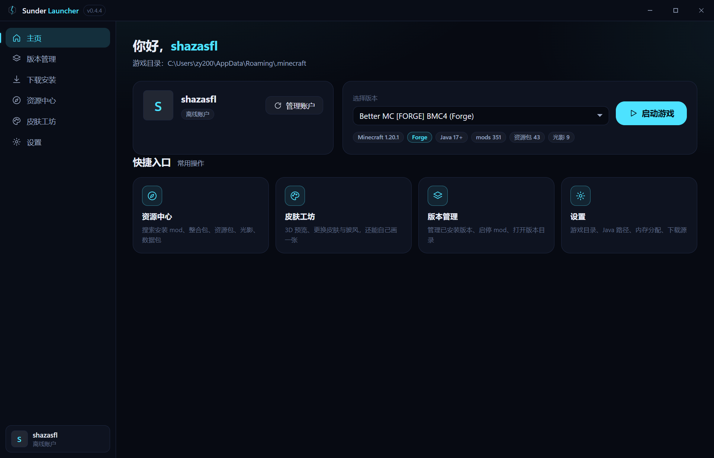
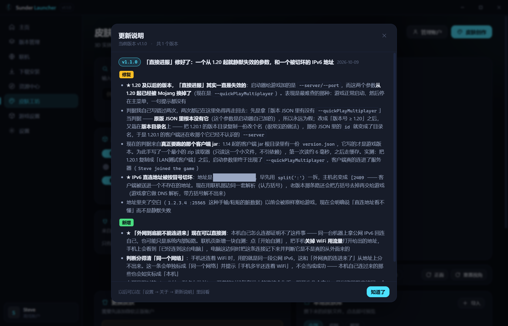
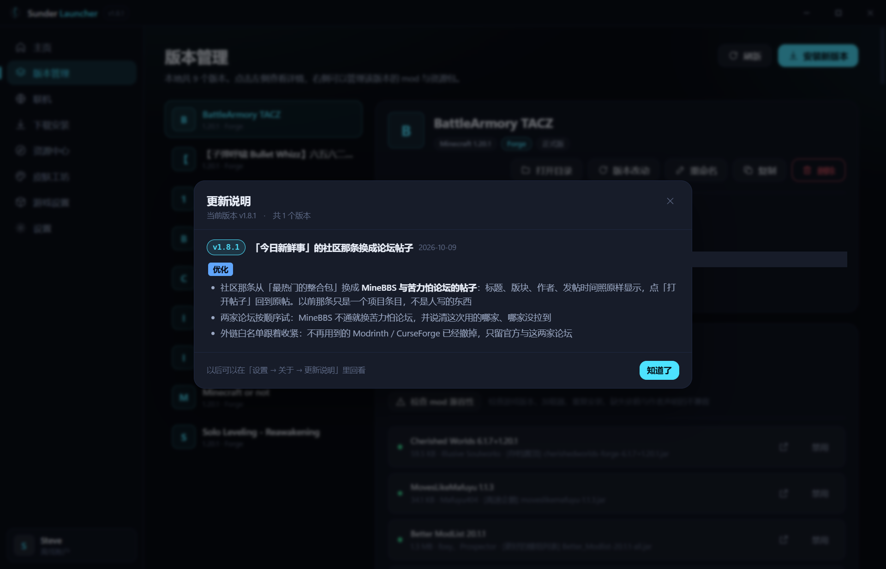
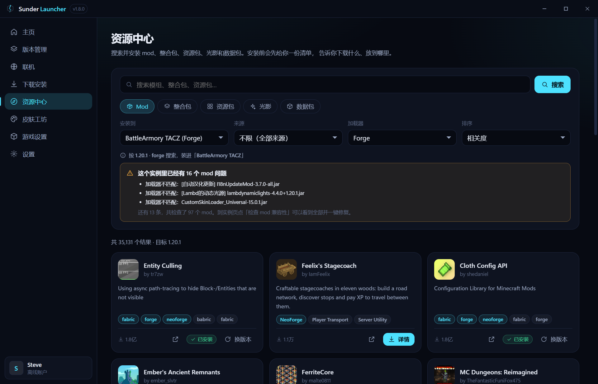
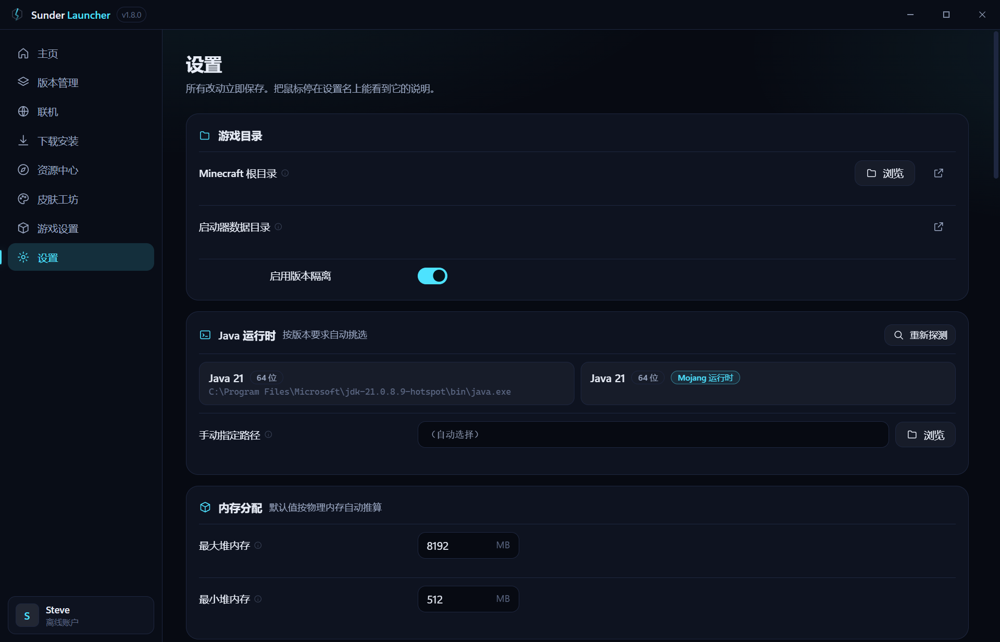

# Sunder Launcher

A desktop launcher for **Minecraft: Java Edition** — version management, mod loaders,
a resource center, a LAN/multiplayer helper, and a skin studio with a 3D preview.

Independent hobby project. Not affiliated with Mojang, Microsoft, or any other launcher.



<!-- download:start -->
## Download

**[Latest release](https://github.com/sunderstirb-cmd/sunder-launcher/releases/latest)** —
`Sunder Launcher-x.y.z-x64.exe` (Windows 10/11, x64). Per-user install, no admin rights,
and it does not remove your data on uninstall.

Once installed, the launcher updates itself: it checks this repository's newest release,
shows what changed, and installs the new version in place (with a `sha256` check before
anything is installed).
<!-- download:end -->

---

## What it does

### Versions and launching
- Installs and launches any release, snapshot, or old version straight from Mojang's
  official metadata, with per-version isolation (each instance gets its own `mods`,
  `config`, `saves`, `resourcepacks` … directories).
- Bundled Java runtime management: picks a suitable JDK for the version you launch,
  and can download Mojang's official runtimes when nothing suitable is installed.
- Detects missing libraries and assets and repairs them from the official sources.

### Mod loaders
- **Fabric**, **Quilt**, **NeoForge** and **Forge**, installed into a separate instance
  so the vanilla version stays clean.
- Forge 1.17+ / NeoForge launch correctly (they need a copy of the vanilla jar in the
  instance directory — a detail that trips up most home-grown launchers).

### Accounts
- **Microsoft** sign-in, using the official Microsoft identity platform only —
  authorization code + PKCE in the system browser, or the device code flow.
- **Offline** accounts for local play.
- **authlib-injector** based sign-in for third-party Yggdrasil servers
  (the user supplies the server URL; the jar is fetched and verified automatically).

### Resource center
- Search and install **mods, modpacks, resource packs, data packs and shaders** from
  Modrinth, CurseForge, FTB and OptiFine.
- Installing a modpack creates a **new isolated instance** (`<pack name>` appears in the
  version list) instead of dumping files into whatever instance you had selected.
- Drag a `.mrpack` / modpack zip onto the window and it installs itself.
- Already-installed content is marked in the search results.

### Skin studio
- 3D preview of any skin (by name or UUID) with working animations
  (idle / walk / run / fly / wave / crouch / hit / swim), drag to rotate,
  scroll to zoom, plus "face forward" and "reset camera".
- A pixel editor with per-body-part colours, mirror-brush, base-layer/outer-layer
  handling and undo history.
- Skin generation: **text → skin** and **image → skin** (structure mapping or
  palette-only), running fully offline. For higher quality the app hands off to a
  third-party generator (LUMEN Weaver) and imports the result back.

### Home
- Your own skin stands next to the account card as a real 3D model, waving — no panel
  behind it. It reads the account's current skin (or the newest one in your local skin
  library) and simply does not appear when there is no skin, rather than showing an
  invisible model. The area reserves room for three models side by side.
- **Today's news** pulls the latest Minecraft patch notes (releases and snapshots) and the
  most-downloaded community modpacks. Every row carries the source's own timestamp — "2
  days ago", never a faked "today" — and each source succeeds or fails on its own, so a
  dead feed is named instead of papered over. Outbound links go through a host allowlist;
  a URL the feed hands us that fails it is dropped rather than opened.
- The launcher itself is one click away: pick a version and press play, with the loader,
  mod count and Java requirement shown right below.

### Playing together (LAN / internet)
- The launcher reads the port Minecraft opens for "Open to LAN" **by asking the OS which
  port the running game process is listening on** (not by scraping logs), then offers
  three ways to reach it: **public IPv6** (no router setup), a short-lease **UPnP**
  mapping (5-minute lease, renewed, ownership-checked before deletion), and
  **Radmin VPN** for networks where neither works.
- A single **invite string** carries the address list plus which instance and game
  version it is; the other side pastes it once, and can write the room straight into
  their multiplayer server list or launch right into it (Quick Play on 1.20+).
- An **external reachability self-test**: the launcher watches the port it opened and
  records every incoming connection, so you can open the address on your phone
  (mobile data, Wi-Fi off) and find out whether the outside really gets in — a browser
  gets a small "you're connected" page (a QR code is drawn for you, so nobody has to type
  an IPv6 address), and the launcher tells you whether that connection came from the
  internet or from a device on the same network (it will not report a same-network or
  same-machine connection as success).
- When nothing arrives, it walks through the four layers that can block inbound — the
  local firewall (read, and fixed from the launcher with one UAC prompt), the router, the
  ISP's ONT, and the carrier — and says plainly when opening a port is a lost cause.
- **Built-in tunnels** for exactly those cases (double NAT, carrier-side filtering): pick
  one of the four blocks on the LAN page and that block is the link this room uses.
  **The launcher ships its own relay as the default route** — nothing to install, nothing to
  fill in: the public port is picked from the range the server allows and the address only
  appears once the relay reports `start proxy success`. **serveo** is the fallback that needs
  no download at all (the OpenSSH client already present on Windows 10+; the public relay
  rate-limits anonymous users, so its own error text is shown verbatim, and since it hands
  out a *domain* — while the invite string only accepts literal IPs — that route sends the
  address rather than an invite). **Radmin** is the third cross-network route (both sides
  install it once). If the link you picked does not come up, the launcher walks the fixed
  order relay → Radmin → serveo, keeps every failure reason, and tells you plainly that it
  switched — it never swaps routes silently. The assigned address comes with a QR code and
  is parsed per provider — never guessed.



---

## Screenshots

| Versions | Resource center |
| --- | --- |
|  |  |



---

## Authentication and compliance

This launcher talks to Minecraft services the same way the official launcher does, and
it does **not** cut any corners:

- Sign-in happens on **Microsoft's own pages**. The launcher never asks for, sees or
  stores an account password — it only ever receives OAuth tokens.
- The OAuth client is a **public client** (no client secret). The build ships with an
  Application (Client) ID that has been **approved through Mojang's AppID review**, so
  Microsoft sign-in works out of the box; users who prefer their own application can
  enter their own Client ID at runtime and it takes precedence. No secret is ever
  bundled, and the launcher only ever sends the OAuth authorization-code + PKCE flow
  (or the device-code flow) that Microsoft documents for public clients.
- Access to Minecraft's APIs requires the application to be **approved through Mojang's
  AppID review process**. If an application is not approved, Minecraft service login
  returns `403 Invalid app registration` — the launcher reports this clearly, points at
  the official form, and never works around it.
- The launcher **does not distribute game files**. Everything is downloaded from
  Mojang's official endpoints (`piston-meta.mojang.com`, `launchermeta.mojang.com`,
  `libraries.minecraft.net`, `resources.download.minecraft.net`) and verified against
  the official metadata.
- It does **not** bypass, disable or imitate any authentication, licensing, entitlement
  or safety check, and it does not pretend to be an official product.
- Name and branding are the project's own; no Mojang/Minecraft/Microsoft/Xbox
  trademarks are used as product identity.

---

## Building from source

Requires Node.js 22.12+ and Windows 10/11 x64.

```bash
npm install
npm run dev          # development
npm run typecheck    # TypeScript, node + web
npm run dist         # build + package (NSIS installer + zip)
```

The project is written in TypeScript: Electron (main/preload) + React + Vite in the
renderer, with `three.js` / `skinview3d` for the 3D preview.

### Tests

There is no unit-test framework; behaviour is verified by a set of standalone assertion
scripts <!-- tests:start -->(**2216 assertions across 36 suites** at the time of writing)<!-- tests:end -->
that exercise the real code paths — including a mock authlib-injector server, a mock
UPnP router, a real Electron process for IPC/preload and clipboard behaviour, a real
TCP listener for the LAN port adapter, and pixel-level checks for skin generation:

```bash
npx vite-node tools/verify-unzip.ts          # zip extraction, path traversal guards
npx vite-node tools/verify-forge-classpath.ts# Forge 1.17+ launch arguments
npx vite-node tools/verify-loopback.ts       # OAuth loopback + PKCE flow
npx vite-node tools/verify-yggdrasil.ts      # authlib-injector flow (local mock server)
npx vite-node tools/verify-lan.ts            # LAN: live port, UPnP lease, invite, dual-stack
npx vite-node tools/verify-direct-connect.ts  # direct-connect args: Quick Play from the jar, IPv6 split
npx vite-node tools/verify-update.ts         # self-update: version compare, download, sha256
npx vite-node tools/verify-skinify.ts        # image → skin structure mapping
npx vite-node tools/verify-skin-generate.ts  # text/image → skin generation
npx vite-node tools/verify-ipc-bridge.ts     # IPC error propagation (real Electron)
npx vite-node tools/verify-lumen-handoff.ts  # clipboard round-trip (real Electron)
```

---

## Current limitations

- The user interface is **Simplified Chinese only** at the moment; localization is
  planned but not implemented.
- CurseForge search requires your own API key (their public-content API is gated);
  Modrinth, FTB and OptiFine work without one.
- Windows-only builds for now.

---

## License

MIT.

Minecraft is a trademark of Mojang Synergies AB. This project is an independent,
unofficial launcher and is not approved by or associated with Mojang or Microsoft.
